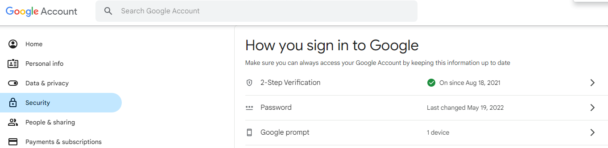
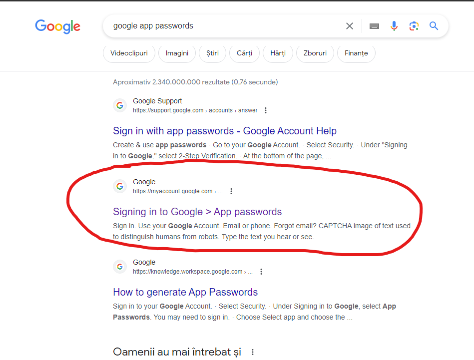
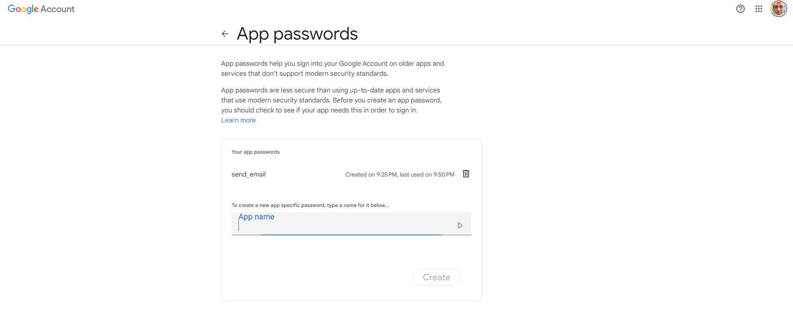
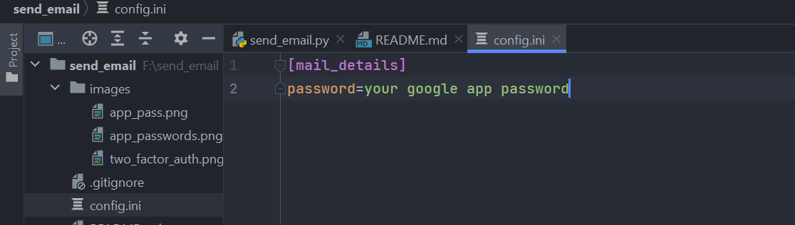

# Send email

This is a simple script that receives the following information as input
 - e-mail sender
 - e-mail receiver
 - e-mail subject
 - e-mail body

It finally sends an e-mail from e-mail sender address (gmail) to e-mail receiver address (any email
service)

### Gmail configuration
To be able to send an e-mail from the gmail account, you have to configure 
the google account accordingly

        1. First add 2 factor authentication to your google account


        
        2. Go to google and search for google app passwords


        
        3. Click on the link, input your google account password
        You will be redirected to the page in the image below 



        4. Fill in the application and a popup with a password
        will show up. Copy the password to config.ini file



### Code example
```py
import send_email as mail

mail_sender = input('e-mail from: ')
mail_receiver = input('e-mail to: ')
subject = input('e-mail subject: ')
body = input('e-mail body: ')

# Create an instance of EmailMessage()
msg = mail.EmailMessage()
msg['From'] = mail_sender
msg['To'] = mail_receiver
msg['Subject'] = subject
msg.set_content(body)

# Get the password from config.ini file
password = mail.get_config_data()

# send the e-mail
mail.send_mail(msg, mail_sender, mail_receiver, password)

```